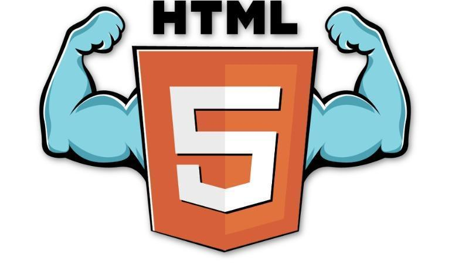

# **Lesson 1 - Intro To HTML5**

## **Overview**

Welcome to our computer science principles!  Our first lesson is on the importance of HTML within the everyday lives of your students.  Students can be asked a variety of questions related to anything within technology.  For instance :

* *What are some apps you use frequently?*

* *What is your favorite website?*

* *Which is your most used social media app?*

* *What do you know about how the internet works?*

The purpose of asking questions such as these to the class will be to have them think and imagine about anything internet related they have seen.  "Seeing" anything on the internet automatically implies html.  Students will watch a brief video on HTML and how it fits into their everyday lives.  Students will also submit a brief personal explanation of what they feel “**computer science”** is to them.  

## **Purpose**

Our **HTML5** introduction will show students the importance of **HTML** within their lives.  This is an exercise inline with **p1** of computer science principles **Connecting Computing**.  Students will be required to **describe connections between people and computing**.  

## **Agenda**

**	****Introduction Remarks**

**	Technology Q&A **

**	Introduction to HTML Video**

**	Live example **

**	What does technology mean to me explanation &  submission**

**	Closing remarks**

## **Teaching Guide**

**_Introduction Remarks & Technology Q&A (15 -20 min)_**

* Welcome to computer science principles!  This school year you will receive an effective education on computer science. 

*  One thing that will make this class unique is our focus on implementation and problem solving within technology.  Problem solving specifically will also help you everyday life when a problem arises.  

* What are some of your favorite apps to use daily? 

* What is your favorite website?  Why is it your favorite site?

**_Introduction to HTML Video (6-10 minutes)_**

*Remarks*

* All of your favorite apps and websites use a markup language called **HTML** to display all of the information to your phones and computer. Here is a brief introduction to the language.  

## **Activity (25 mins)**

**Description: **

	Students are required to write down what they believe computer science is currently.  Have them either submit it via a [worksheet](https://docs.google.com/document/d/1GGjMSIPp1fnztguhZMcviIpSeIXz951hWlKoUtJAayQ/edit?usp=sharing) provided by this curriculum.  Or via a form of some sort such as **[google form**s](https://www.google.com/forms/about/) (environmentally friendly option).   

## **Standards Alignment**

CSTA K-12 Computer Science Standards 

* 3B-IC-26 - **Evaluate the impact of equity, access, and influence on the distribution of computing resources in a global society.**

